# OKX加密货币交易所：完整操作指南

如果你正在寻找一个功能齐全、操作简便的加密货币交易平台，OKX可能是个不错的选择。这个成立于2013年的老牌交易所，现在服务着来自180个国家的数百万用户。无论你是刚入门的新手，还是经验丰富的交易者，这里都能找到适合你的工具。本文会手把手教你如何注册、验证身份，以及开始你的第一笔交易。

---

## OKX是什么？

OKX从2013年就开始运营了，算是加密货币交易所里的"老前辈"。一开始它只是个普通的兑换平台，现在已经发展成一个功能相当全面的交易生态系统。

简单来说，OKX想做的就是让你在一个平台上搞定所有事情——不用在好几个交易所之间跳来跳去找不同的币种或功能。他们自己的说法是"创新金融平台"，听起来有点官方，但确实挺准确的。

---

## 这个平台有什么特别的？

### 基础功能相当齐全

OKX的界面支持多种语言，网页版和手机App都做得挺顺手。你能在上面交易加密货币、法币、NFT，还有期货、期权这些进阶玩意儿。

如果你不想盯盘，平台还提供交易机器人。想快速换币？有闪兑功能。更喜欢点对点交易？P2P市场也有。另外还能质押赚币，相当于"存款吃利息"。

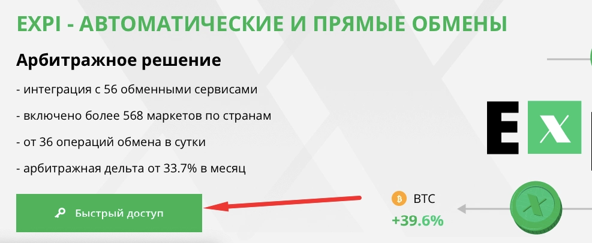

### 手续费比较实在

OKX采用固定费率，按照挂单者(Maker)和吃单者(Taker)收取。如果你是VIP用户或者持有平台币OKX，手续费还能打折。对比某些动不动就收高额手续费的平台，这点挺良心。

### 客服24小时在线

遇到问题随时能找人问，这点对新手来说挺重要的。毕竟刚开始玩加密货币，难免会有各种不懂的地方。

---

## 注册流程：五分钟搞定

### 第一步：创建账户

打开OKX官网，点击右上角的"创建账户"按钮。填写邮箱地址，如果有邀请码也可以输入（👉 [点这里直接注册还能领新手福利](https://www.okx.com/join/62834398)）。

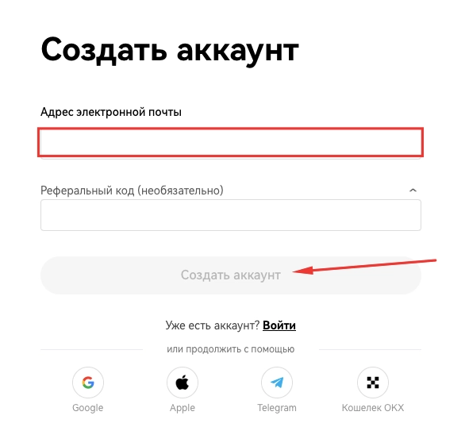

点击"创建账户"后，你的邮箱会收到一个验证码，把它填进去就行。

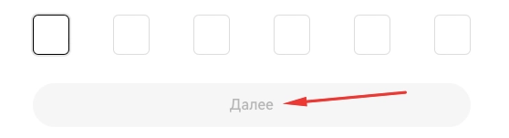

### 第二步：绑定手机号

接着要验证手机号，流程和邮箱一样——输入号码，收验证码，填进去。

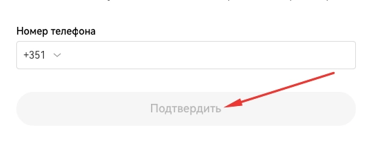

### 第三步：完善基本信息

选择你的居住国家，勾选同意条款和隐私政策（记得看一眼，虽然大多数人都直接划过去）。

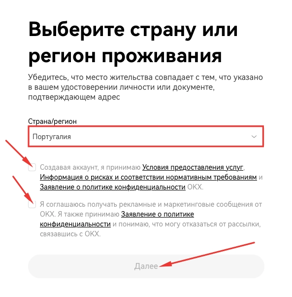

最后设置一个强密码——建议用大小写字母+数字+符号组合，别用"123456"这种送人头的密码。设置完就算注册成功了。

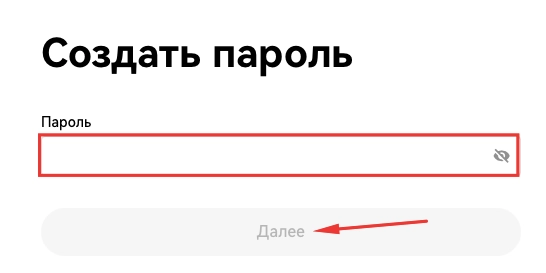

---

## 身份验证：这一步跑不掉

如果只是随便看看行情，不验证也没关系。但要真金白银地交易，就必须完成身份验证。这是监管要求，所有正规大平台都得这么做。

### 怎么验证？

登录后在首页点击"通过验证"链接，选择"个人身份验证"，然后点"确认身份"。

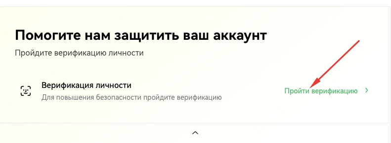

平台会先给你看一遍验证须知，大概就是告诉你需要准备什么材料。看完继续。

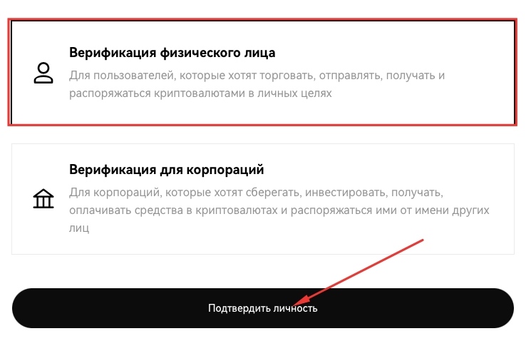

选择你的国家和证件类型（身份证、护照或驾照），然后点"下一步"。

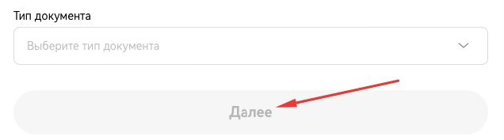

如果你在电脑上操作，这时候会弹出一个二维码，用手机扫一扫继续。因为需要拍照——给证件拍张照，再来张自拍。另外还要填一份基本信息表，包括姓名、出生日期这些。最后上传一个能证明你住址的文件，比如水电费账单。

验证一般24小时内能通过，着急的话可以联系客服催一下。

---

## 开始交易：从充值到下单

### 往账户里打钱

验证通过后，点击顶部菜单的"资产"，选择"充值"。从列表里选你要充值的币种，平台会生成一个地址，把币从你的钱包或其他交易所转过来就行。

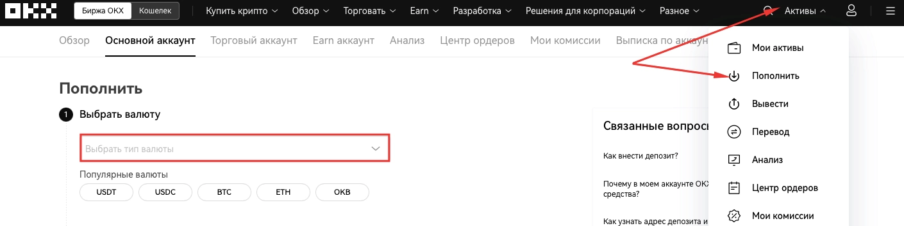

记得检查网络类型，别搞错了。比如USDT有TRC20、ERC20、BEP20好几种，选错了币就丢了。

### 进行第一笔交易

点击"交易"选择"现货"，这是最简单的买卖方式。用搜索框找到你想交易的币对，比如BTC/USDT。

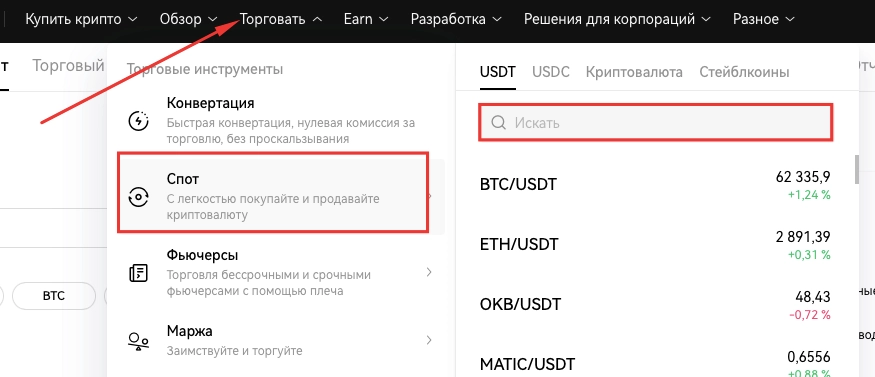

页面往下拉，你会看到买入和卖出的订单框。选择订单类型（市价单最简单，按当前价格立刻成交），输入你要买的数量，点"买入"就完成了。

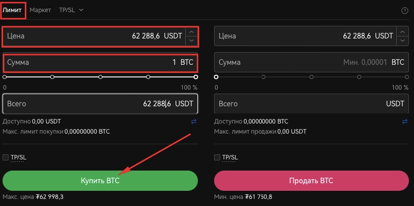

### 提现到自己的钱包

如果想把币转到冷钱包或其他地方，在"资产"里点"提现"，选择币种、输入数量和目标地址。再次提醒，地址和网络都要核对清楚。

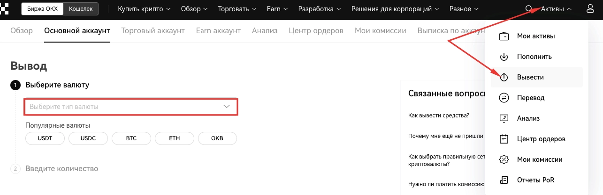

---

## 用户怎么评价OKX？

网上关于OKX的讨论挺多的。大多数人觉得平台功能丰富、手续费合理、界面友好。当然也有人抱怨必须完成身份验证才能正常使用，但这已经是行业标准了——想在正规平台交易，这道程序基本绕不过去。

新手用户普遍反映上手不难，教程资料也比较全。老手们则更关注流动性和交易深度，这方面OKX作为头部交易所表现还不错。偶尔会有人提到客服响应速度的问题，但整体来说支持团队还算靠谱。

如果你之前没找到特别满意的交易平台，👉 [不妨试试OKX看看是否符合你的需求](https://www.okx.com/join/62834398)——反正注册免费，多一个选择总没坏处。
